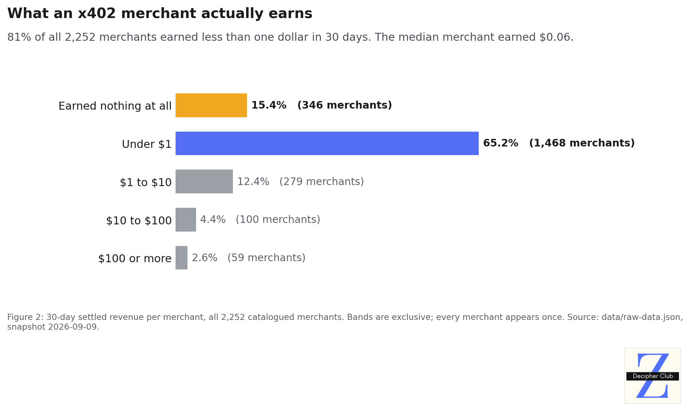
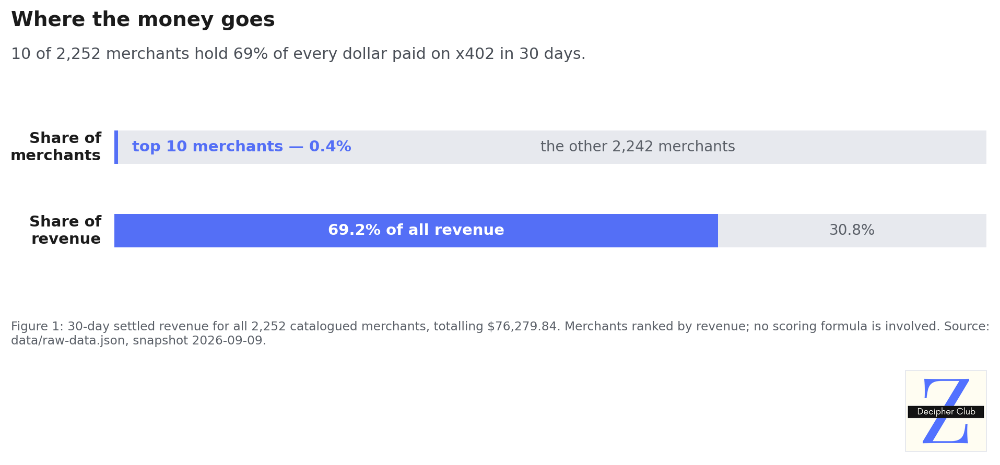

# x402-unfairness-audit

An open, reproducible audit of how x402 discovery indexes rank merchants for AI agents.
It tests one question: can a new merchant earn a place in the rankings, or does ranking only reward merchants that are already selling?

---

## Audit details

- **Snapshot:** the full x402 merchant catalog, frozen on 9 Sep 2026. It covers 2,252 merchants, 42,201 resources and 13 categories.
- **Analysed:** 839 merchants, with $38,735 in combined 30-day volume.
- **Categories:** Crypto & DeFi (497), AI & Agents (194), Data & Enrichment (91), Finance & Markets (57).
- **Excluded:** 1,256 merchants in the uncategorised "Other" bucket and 157 in categories too thin to measure.
- **Method:** every merchant is scored with a reconstructed ranking formula, then the top of each category is compared with the bottom.

---

## Key findings

- **New merchants can't get started.** Rankings are driven by sales, and a new merchant has none. That means it can't rank, so agents don't find it, so it never makes the sales it needs to rank.
- **A perfect listing isn't enough.** A merchant with zero sales and a flawless listing scores at most 0.3250, and none of the 79 zero-sale merchants got past it.
- **Incumbents sit far above that.** The top 3 merchants in each category average 0.5366–0.6504, beyond anything a newcomer can reach.
- **Better listings barely move the rank.** Listing quality explains at most 13.4% of the gap between a category's top and bottom, and −0.3% in Finance & Markets.
- **Example:** Honeyguide Verified Router has the best listing in Crypto & DeFi and ranks 250th of 497, with 3 sales in 30 days.

---

## What the market looks like

Ranking decides who gets paid, and this is what there is to be paid.



Four out of five merchants earned less than a dollar in thirty days. The median merchant earned six cents.



Ten merchants, 0.4% of the catalog, hold 69% of every dollar paid. Both figures are regenerated from the snapshot by `charts/r2_earnings_distribution.py` and `charts/r1_revenue_concentration.py`.

---

## Why this exists

- AI agents pay x402 merchants per request, and they find them through discovery indexes: CDP Bazaar, x402scan and AgentCash.
- Those indexes return a short ranked list, so the ranking decides who gets paid.
- If that ranking locks new merchants out, the agent economy concentrates before it has even started. This repo measures whether it does.

---

## Quick start

**Requires Node 22+.** The only dependencies are `tsx` and `typescript`.

```bash
git clone https://github.com/zaryab2000/x402-unfairness-audit
cd x402-unfairness-audit
npm install
npm run all
```

`npm run all` runs three steps in a few minutes:

1. **`analyze`** computes concentration, the quartile gap breakdown and the cold-start ceiling from the snapshot.
2. **`recut`** repeats the core comparison on raw listing fields with no scoring formula, as a robustness check.
3. **`verify`** checks every figure in `claims.json` against the data and exits non-zero on any mismatch.

**What to expect.** A clean run ends like this:

```
  150 passed, 0 failed, 2 external (not verified here)

    component        exact matches   of
    volumeSignal              2252   2252
    buyerDiversity            2252   2252
    reliability               2252   2252
    listingQuality            2252   2252
    recency                   2252   2252

  All verifiable claims reproduce from the committed artifacts.
```

- **150 passed:** every claim resolves to its stated value. The 2 external claims are third-party figures and are labelled as such.
- **2252 of 2252:** the formula in `src/ranker.ts` reproduces every stored score for every merchant exactly.

**Checking a single number.** Each figure is an entry in `claims.json`, recording its value, the source file and the path that derives it. To inspect one merchant directly:

```bash
node -e '
const { merchants } = require("./data/raw-data.json");
const m = merchants.find(m => m.resources.some(r => /honeyguide/i.test(r.serviceName ?? "")));
console.log(m.categoryName, "rank", m.rankPosition, "| txs", m.txCount30d, "| usd", m.volume30d,
  "| listingQuality", m.scoreBreakdown.listingQuality);'
# Crypto & DeFi rank 250 | txs 3 | usd 0.023103 | listingQuality 0.9077333333333333
```

That merchant has the best listing in Crypto & DeFi, and it ranks 250th of 497.

---

## The ranking formula

```
score = 0.40·volume + 0.25·buyerDiversity + 0.05·reliability + 0.15·listingQuality + 0.15·recency
```

| Component      | What it measures                                                       |
| -------------- | ---------------------------------------------------------------------- |
| volume         | 30-day transactions and USD volume, log-scaled                         |
| buyerDiversity | 30-day distinct paying wallets, log-scaled                             |
| reliability    | Service health. It is a constant 0.5, because no index exposes it.     |
| listingQuality | Input schema, output example, description, service name, tags, icon    |
| recency        | Decay ladder on last activity: <1d 1.0 · <7d 0.8 · <30d 0.5 · <90d 0.2 |

### How it was derived

- **Signals:** taken from CDP Bazaar's docs and the x402scan and AgentCash source. All three read transactions and recency, and two read buyers and metadata.
- **Weights:** this study's own judgement, since no index publishes its weights. Transaction signals get 65%, metadata and recency get 15% each, and reliability gets a 5% placeholder.
- **Robustness:** any formula where transaction history is the largest term gives the same result, and `npm run recut` confirms it with no formula at all.
- **Ceiling:** 0.15 (perfect listing) + 0.15 (full recency) + 0.025 (reliability) = 0.3250.

**Disagree with the weights?** Edit `RANKER_WEIGHTS`, run `npm run analyze`, and compare. Definitions and edge cases are in [`docs/METHODOLOGY.md`](docs/METHODOLOGY.md).

---

## Known limitations

- **The market is small and the analysis covers four categories.** The concentration findings cover 839 of the 2,252 merchants in Crypto & DeFi, AI & Agents, Data & Enrichment and Finance & Markets, with about $38,735 of 30-day volume between them. The remaining 1,413 sit in the uncategorised "Other" bucket or in categories too thin to measure.
- **The snapshot is one moment.** Everything describes 9 September 2026, and nothing here forecasts how rankings evolve.
- **The formula is a reference model.** Production weights are unpublished, and reliability is a placeholder that separates no one.

---

## Disclosure

The author builds a merchant-analytics service for the x402 ecosystem, which is a commercial interest in how discovery gets ranked. That interest is why the full snapshot and the scoring code are published, so every figure can be re-derived or refuted independently. The author's own listing sits in the excluded "Other" bucket and affects no analysed figure.

Found an error? [Open an issue](https://github.com/zaryab2000/x402-unfairness-audit/issues) and include the `claims.json` id.

## Licence

Code (`src/`, `scripts/`) is MIT. Data (`data/`, `claims.json`) is CC0-1.0.
